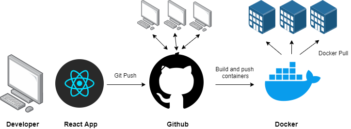

# NUS FintechSG DevOps Course

All things about Dockers, Containers and Kubernates

# CI/CD Assignment Walkthrough

## Workflow



**Objective:** Build and push a React App to Docker Hub upon each Git push using Grithub actions

## Step 1: Create a New Git Repo

Create a new git repo on your local computer

[Guide](https://kbroman.org/github_tutorial/pages/init.html)

## Step 2: Create new React App in Repository

Go to the location of your Git Repo in your command prompt and type the following.

Commit the changes to Github.

```npx create-react-app <APP-NAME>```

## Step 3: Dockerization of React App

Create a new file and name it 'Dockerfile' and add the following text into the file

```
FROM node:alpine

WORKDIR '/app'

COPY package.json .

RUN npm install

COPY . .

EXPOSE 3000

CMD ["npm", "start"]

```

[Guide](https://www.youtube.com/watch?v=O3SvhpnSZWY)
**Note:** Remember to add ```Expose 3000``` in the Dockerfile, this will allow us to access the container on a local browser via ```http://localhost:3000/```

## Step 4: Create Git Action to Build and Push Container to Docker Hub

Under the Actions tab, create a new workflow and add the following text into the YAML file:

```
name: Login, build and push to Docker

on:
  push:
    branches: master

jobs:
  login:
    runs-on: ubuntu-latest
    steps:
    - 
      name: Checkout code
      uses: actions/checkout@v2

    - 
      name: Build and push Docker images
      uses: docker/build-push-action@v1
      with:
        username: ${{ secrets.DOCKER_USERNAME }}
        password: ${{ secrets.DOCKER_PASSWORD }}
        repository: <YOUR-USERNAME>/<DOCKERHUB-REPO-NAME>
        tags: latest
        
```

This workflow will login to Docker, build the React App and push it to Docker Hub upon a Git Push to the Master branch.

```${{ secrets.DOCKER_USERNAME }}``` and ```${{ secrets.DOCKER_PASSWORD }}``` are secret variables containing the username and password of your Docker account. Secret variables allow sensitive information to stay hidden in your code. They can be managed under Settings > Secrets. 

[Docker Github Actions](https://github.com/docker/build-push-action)\
[YouTube Explanation on using Github Actions for Docker](https://www.youtube.com/watch?v=09lZdSpeHAk&t=457s)

## Step 5: Debug

Dicipher the error message, don't give up!

Test it by pulling your container and see if the changes in your React App is reflected via [http://localhost:3000/](http://localhost:3000/)


